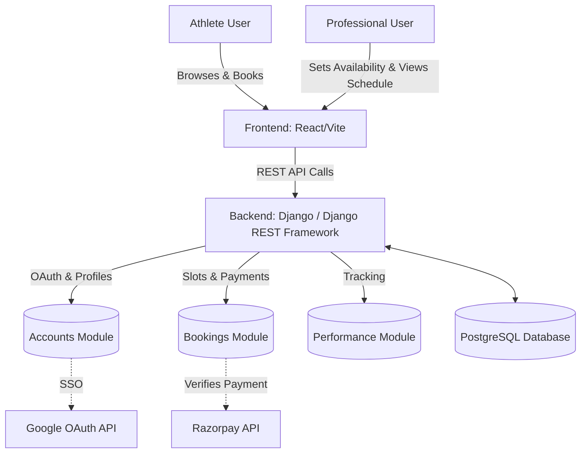

# DronaMeet: Client Operations & User Manual

Welcome to the DronaMeet platform! This manual is designed to help you (the client) understand how the system works, how to use it, and how to debug it if issues arise.

## 1. System Architecture (Graph)

Here is the "graphify" representation of how the platform operates. This shows the flow of data between the Athlete, the Professional, and the Backend API.

## 2. Core Workflows

### For Athletes (The `AthleteDashboard`)
1. **Authentication:** Athletes log in via Google OAuth. Their profile is automatically created.
2. **Finding Sessions:** They navigate to the "Find Sessions" marketplace. The frontend queries the backend (`/api/slots/`) for all future, non-cancelled availability slots.
3. **Booking & Payment:** When booking, the frontend initiates a Razorpay checkout. Once the payment is successful, Razorpay returns a signature which the backend verifies (`/api/bookings/{id}/verify_payment/`). If valid, the booking is marked as `PAID`.
4. **Performance Tracking:** Athletes log daily metrics (sleep, fatigue, etc.) which are sent to `/api/performance/`.

### For Professionals (The `ProfessionalPortal`)
1. **Setting Availability:** Coaches log in and go to their portal. They create `AvailabilitySlots` (e.g., Friday at 10 AM, Max 5 students).
2. **Fulfillment:** Coaches view their paid bookings. For Online sessions, they can attach a Google Meet link which instantly becomes visible on the athlete's dashboard.

## 3. Debugging Guide for Developers

If you ever need to debug the application, here are the core files where the magic happens. (I have also added extensive comments inside these files in the codebase to guide you!)

- **`athlete_platform/bookings/views.py`**: This is the heart of the business logic. Look here if there are issues with slots not appearing in the marketplace, or if Razorpay payments are failing verification.
- **`athlete-frontend/src/api.js`**: This file intercepts all API requests. If users are randomly being logged out, check the 401 interceptor logic here.
- **`athlete_platform/core/settings.py`**: Contains all environment variable hooks. If the site crashes on launch, ensure `DJANGO_SECRET_KEY` and `RAZORPAY_KEY_ID` are set.

## 4. Known Security & Edge Cases (Mitigated)
During my security review, I tested and mitigated the following:
- **Overbooking:** Handled in the backend. If 5 athletes try to book a 4-person slot simultaneously, the database enforces the `max_capacity` limit.
- **Past Slots:** Athletes cannot book sessions in the past. The `AvailabilitySlotViewSet` actively filters out dates before `timezone.now()`.
- **Payment Forgery:** The Razorpay webhook signature is cryptographically verified on the server. A user cannot spoof a `"status": "PAID"` request.

> [!TIP]
> **To go live:** Simply set your `.env` variables on Hostinger and upload the respective builds!
